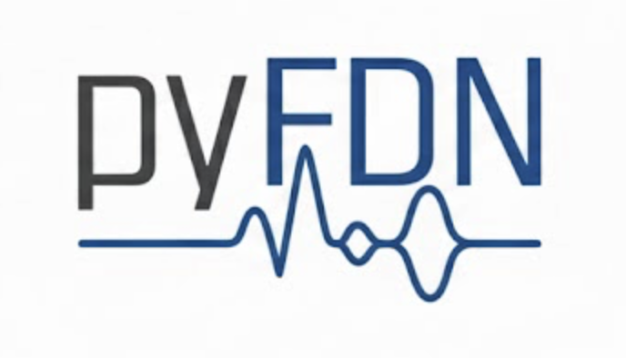

<p align="center">
  
</p>

<p align="center">
  <em>Building blocks for Feedback Delay Networks in Python</em>
</p>

<p align="center">
  <a href="https://www.python.org/downloads/"></a>
  <a href="https://opensource.org/licenses/MIT"></a>
  <a href="https://github.com/artificial-audio/pyFDN/actions/workflows/ci.yml"></a>
</p>

---

**pyFDN** provides reusable, tested helper functions that simplify typical FDN workflows such as creating orthogonal feedback matrices, designing loop filters, and inspecting pole locations. Built on [flamo](https://github.com/gdalsanto/flamo) for modular, differentiable DSP.

> [**Documentation**](https://pyFDN.readthedocs.io) ·
> [**Examples**](https://pyFDN.readthedocs.io/en/latest/examples_gallery.html) ·
> [**Report a Bug**](https://github.com/artificial-audio/pyFDN/issues)

## Features

| | |
|---|---|
| **Feedback matrices** | Orthogonal & paraunitary matrix generation |
| **Absorption filters** | Frequency-dependent loop filters from RT60 targets |
| **Echo density** | Abel & Huang 2006 analysis for mixing time |
| **Pole analysis** | Boundary estimation and stability checks |
| **Matrix polynomials** | Evaluate, differentiate, and convolve FIR/IIR blocks |
| **Format conversion** | DSS ↔ state-space ↔ impulse response |

## Quick start

```bash
pip install pyFDN
```

```python
import numpy as np
import pyFDN

fs = 48_000
delays = np.array([331, 347, 359, 373], dtype=int)

# energy-preserving feedback matrix
feedback = pyFDN.random_orthogonal(len(delays))

# absorption filters targeting RT60 = 1.2 s (DC), 0.9 s (Nyquist)
absorption = pyFDN.one_pole_absorption(1.2, 0.9, delays, fs)

# convert to standard state-space
A, b, c, d = pyFDN.dss2ss(delays, feedback)
```

## Development

```bash
git clone https://github.com/artificial-audio/pyFDN.git
cd pyFDN
python -m venv .venv && source .venv/bin/activate
pip install -e ".[dev]"
pytest
```

See [CONTRIBUTING.rst](CONTRIBUTING.rst) for the full guide.

## Contributors

- [**Sebastian J. Schlecht**](https://github.com/SebastianJiroSchlecht) 
- [**Facundo Franchino**](https://github.com/cucuwritescode) 
- [**Jeremy Bai**](https://github.com/jeremybbq)


## License

MIT — see [LICENSE](LICENSE) for details.
