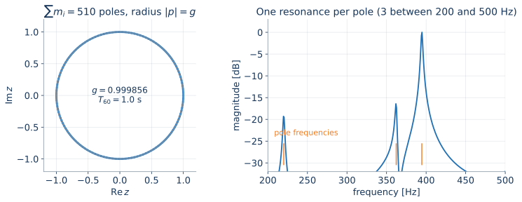
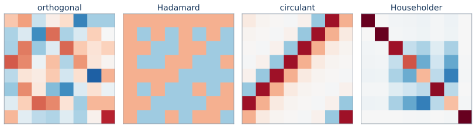
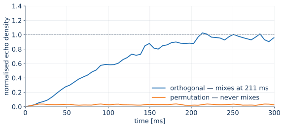
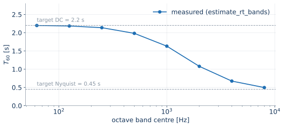
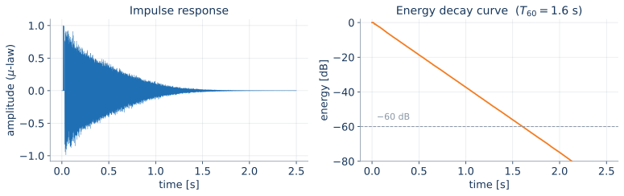
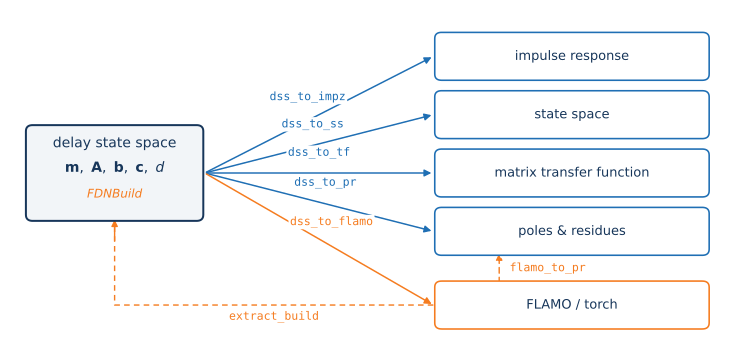
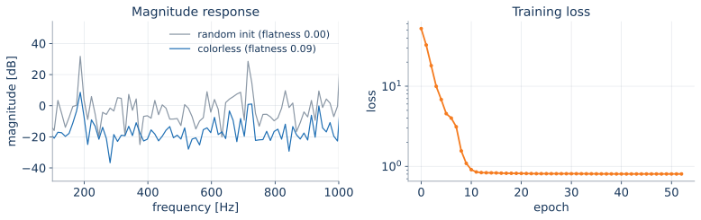

## Ninety minutes, six moves {.smaller}

::: {.timing}
0:00 — 5 min
:::

| Time  |     | Segment                                | You will…                                        |
| ----- | --- | -------------------------------------- | ------------------------------------------------ |
| 0:00  | 15  | **What is an FDN?**                    | read the block diagram and the transfer function  |
| 0:15  | 15  | **pyFDN, the tour**                    | know where everything lives, run five lines       |
| 0:30  | 25  | **Hands-on 1 — build one**             | design delays, matrix, decay; listen to it        |
| 0:55  | 20  | **Hands-on 2 — optimise one**          | train a colorless FDN, match a measured room      |
| 1:15  | 10  | **Beyond the vanilla FDN**             | see where the research frontier is                |
| 1:25  | 5   | **Q&A**                                | ask the awkward questions                         |

::: {.dim}
Slides, notebooks and setup instructions: **[artificial-audio.github.io/pyFDN](https://artificial-audio.github.io/pyFDN/)**
:::

::: notes
Housekeeping first: everyone who wants to code along, open the setup page now —
the install takes about two minutes and we start typing at 0:30. Anyone who
can't install: pair up, or just watch. Every notebook is also rendered on the
website, so nothing is lost.

Say the honest framing: this is both a tutorial on FDN theory and the public
release of pyFDN. If you find a bug today, that is a feature of the format.
:::

## Before we start {.smaller}

::: {.columns}
::: {.column width="55%"}
```bash
# 1. an environment (uv, conda, venv — your pick)
uv venv --python 3.11 && source .venv/bin/activate

# 2. the toolbox plus notebook extras
uv pip install "pyfdn[examples]"

# 3. the notebooks
git clone https://github.com/artificial-audio/pyFDN
cd pyFDN && marimo edit examples/
```

Check it works:

```python
import pyFDN
print(pyFDN.__version__)
pyFDN.is_orthogonal(pyFDN.random_orthogonal(8))  # True
```
:::

::: {.column width="45%"}
**If the install fails**

- The rendered notebooks on the website need nothing but a browser
- `pyFDN[examples]` pulls `torch` via `flamo` — that is the big download
- Ask a neighbour; ask us

**What you need to know already**

- Python and NumPy
- filtering, convolution, the *z*-plane
- *not* FDNs — that is the next 15 minutes
:::
:::

::: notes
Do the version print on the projector so people can compare against their own
output. Mention the pinned version for the tutorial (see the setup page) — if
someone is on a newer release and a call signature differs, the frozen slides
are the record of what was true today.
:::

# 1 · What is an FDN? {background-color="#17365a"}

::: notes
15 minutes. Goal: everyone can read the block diagram, and everyone knows the
three knobs (delays, matrix, absorption) and the three properties they control
(density, mixing, decay). No pyFDN in this section at all — theory only.
:::

## Reverberation is expensive {.smaller}

::: {.columns}
::: {.column width="50%"}
**Convolution with a measured RIR**

- exact, and expensive: 2 s at 48 kHz = 96 000 taps
- one room per impulse response
- no parametric control — you cannot ask it for "0.4 s less at 4 kHz"
:::

::: {.column width="50%"}
**Recursive (feedback) reverberation**

- a handful of delay lines, reused forever
- cost is independent of the decay time
- parametric by construction: decay, colour, density are knobs
:::
:::

> An FDN buys an infinite impulse response for the price of *N* delay lines and one *N × N* matrix multiply per sample.

::: notes
Give the numbers out loud: a 32-line FDN at 48 kHz is ~1000 multiply-adds per
sample for the matrix plus the delay reads. Compare to partitioned FFT
convolution. The point is not that FDNs are always cheaper — it is that they are
*parametric*, and that is what makes them designable and optimisable.
:::

## The lineage {.smaller}

| Year | Who | Idea |
| --- | --- | --- |
| 1961 | Schroeder & Logan | comb + allpass chains; "colorless" as an explicit goal |
| 1976 | Gerzon | unitary networks — losslessness as a matrix property |
| 1982 | Stautner & Puckette | the 4-line feedback matrix; the FDN as we draw it |
| 1991 | Jot & Chaigne | per-line absorption filters → prescribed $T_{60}(\omega)$ |
| 1997 | Väänänen et al., Rocchesso | efficient structures, modal analysis |
| 2010s– | Schlecht et al. | stability, modal decomposition, allpass & scattering FDNs |
| 2023– | Dal Santo, Schlecht et al. | differentiable FDNs, colorless optimisation |

::: {.dim}
Sixty years of a structure that is still producing papers — which is exactly why it deserves a toolbox.
:::

::: notes
Do not read the table. Pick three: Schroeder (the problem statement —
coloration), Stautner & Puckette (the picture we are about to draw), Jot (the
reason FDNs are usable in practice — you can *prescribe* the decay).

Optional graphic to drop in here: the Schroeder allpass chain figure from an
earlier talk, next to the FDN diagram, to show the FDN as its generalisation.
:::

## The structure {background-image="figures/out/diagram.svg" background-size="88%" background-position="center bottom"}

::: {.timing}
0:05
:::

::: notes
Walk the signal. Input scatters into N delay lines through **b**. Each line
delays by m_i samples. The delayed outputs are mixed by **A** and fed back.
Output is a weighted sum through **c**, plus the direct path d.

Ask the room: what happens if A is the identity? (N independent comb filters —
metallic, no mixing.) What if A is a permutation? (One long comb — we will
*hear* this in a minute.)
:::

## The same thing, in four lines of algebra {.smaller}

Delay state-space (DSS) — the form pyFDN uses everywhere:

$$
\mathbf{s}(n+1) = \mathbf{A}\,\mathbf{s}(n - \mathbf{m}) + \mathbf{b}\,x(n), \qquad
y(n) = \mathbf{c}^{\!\top}\mathbf{s}(n) + d\,x(n)
$$

Transfer function, with $\mathbf{D}(z) = \operatorname{diag}\!\big(z^{-m_1}, \dots, z^{-m_N}\big)$:

$$
H(z) = \mathbf{c}^{\!\top}\big(\mathbf{D}(z)^{-1} - \mathbf{A}\big)^{-1}\mathbf{b} + d
$$

Poles are the roots of the **generalised characteristic polynomial**:

$$
p(z) = \det\!\big(\mathbf{D}(z)^{-1} - \mathbf{A}\big) = 0
\qquad\Rightarrow\qquad
\textstyle\sum_i m_i \ \text{poles}
$$

::: {.dim}
Four parameters — $\mathbf{m}, \mathbf{A}, \mathbf{b}, \mathbf{c}$ (and $d$) — and one nonlinear eigenvalue problem hiding in the determinant.
:::

::: notes
This is the densest slide in the theory section; spend two minutes on it.

The one thing to make stick: the number of poles is the *sum* of the delay
lengths, not N. A 8-line FDN with delays around 2000 samples has ~16 000 poles.
That is why FDNs sound dense, and why analysing them is not trivial.

Mention that dss_to_pr solves exactly this determinant problem numerically, and
that "eig / roots / eai" are three different ways to do it.
:::

## Knob 1 — the delays set the density {.smaller}

::: {.columns}
::: {.column width="52%"}
- $\sum_i m_i$ poles, spread near-uniformly in frequency
- **modal density** $\approx \sum_i m_i / f_s$ modes per Hz
- **echo density** grows as $t^{N-1}$ before mixing
- mutually coprime lengths avoid coincident modes
- physical anchor: mean free path $\bar{d} = 4V/S$
:::

::: {.column width="48%"}

:::
:::

::: notes
The left panel is the "all poles on a circle of radius g" picture. Point out
that the radius is the *per-sample* gain, and that its distance from the unit
circle is tiny (0.999856 for a 1-second decay) — which is exactly why FDN
stability analysis needs care in floating point.

The right panel is the payoff: each pole is one resonance you can see in the
magnitude response.
:::

## Knob 2 — the matrix mixes {.smaller}



- **Lossless** $\Leftrightarrow$ $\mathbf{A}$ unitary (up to a diagonal similarity) $\Rightarrow$ poles on the unit circle
- Orthogonal, Hadamard, circulant, Householder — same losslessness, different *mixing speed* and different cost
- Sparse/structured matrices buy back the $\mathcal{O}(N^2)$ multiply

::: notes
Losslessness is a property you can check, and pyFDN checks it: is_orthogonal,
is_unilossless, is_paraunitary. Emphasise "up to a diagonal similarity" — that
is Schlecht & Habets' generalisation and it is what makes velvet-noise and
sparse matrices admissible.

Cost aside: Hadamard is N log N via a butterfly, circulant is an FFT, a
permutation is free. Householder is one dot product.
:::

## Mixing is audible {.smaller}

::: {.columns}
::: {.column width="60%"}

:::

::: {.column width="40%"}
Normalised echo density (Abel & Huang 2006) reaches 1 when the response is
statistically Gaussian — that is "mixed".

- **orthogonal**: mixes at ~180 ms
- **permutation**: never mixes — a single long comb filter

Same delays, same decay, same losslessness. Only the matrix changed.
:::
:::

::: {.live}
Play both impulse responses. The permutation FDN is the sound of a bad reverb.
:::

::: notes
This is the first listening moment — get it right. Two files, A/B, no
commentary until after both have played. Then say: everything else in this
tutorial is about controlling what you just heard.
:::

## Knob 3 — absorption sets the decay {.smaller}

::: {.columns}
::: {.column width="50%"}
Broadband: put the gain in the loop, proportional to the delay length —
**homogeneous** decay, all poles on one circle:

$$
\gamma = 10^{-3 / (f_s\,T_{60})}, \qquad
\mathbf{A}_{\text{lossy}} = \operatorname{diag}(\gamma^{m_i})\,\mathbf{A}
$$

Frequency-dependent: replace each scalar with a filter $H_i(z)$ whose magnitude
follows $\gamma(\omega)^{m_i}$ — one filter per line, designed once.
:::

::: {.column width="50%"}

:::
:::

::: {.dim}
Homogeneity is what makes the decay predictable — and what a graphic-EQ absorption design preserves per band.
:::

::: notes
The measured curve is the sanity check that closes the loop: prescribe 2.2 s at
DC and 0.45 s at Nyquist, build the filters, measure the result back out of the
impulse response with estimate_rt_bands. It lands on target. That round trip is
the single most useful thing in the toolbox for practical work.
:::

## What decay looks like {.smaller}



- Impulse response ($\mu$-law compressed, so the tail stays visible)
- Energy decay curve = backward energy integral; the $-60$ dB crossing *is* $T_{60}$

::: notes
Note the EDC is almost perfectly straight — that is the homogeneous decay
working. Keep this slide in mind for the coupled-rooms segment at the end,
where the EDC bends and a single T60 stops meaning anything.
:::

## So what is actually hard? {.smaller}

::: {.incremental}
1. **Coloration.** A lossless FDN's magnitude response is *not* flat. Ringing modes are audible as metallic colour. Schroeder's 1961 problem is not closed.
2. **Stability under modulation.** Time-varying matrices can pump energy into the loop; "unitary at every instant" is not sufficient.
3. **Matching a real room.** You have a measured RIR and want an FDN that sounds like it. Which of the $N^2 + 2N$ parameters do you turn?
4. **Everything is coupled.** Delays change the density *and* the colour; the matrix changes the mixing *and* the modal excitation.
:::

> Analysis is linear algebra. **Design is optimisation.** That is the case for a differentiable toolbox.

::: notes
This slide is the hinge of the whole tutorial. Land point 4 hard: the reason
people hand-tune reverbs for weeks is that the parameter interactions are not
separable. Then the second half of the tutorial has an obvious motivation.
:::

# 2 · pyFDN, the tour {background-color="#17365a"}

::: notes
15 minutes. Goal: after this, nobody has to guess where a function lives, and
everyone has seen a reverb come out of five lines of code.
:::

## Design principles {.smaller}

::: {.columns}
::: {.column width="50%"}
**Functions, not a framework**

- flat namespace: everything is `pyFDN.<thing>`
- NumPy in, NumPy out
- no session object, no config singleton, no builder DSL to learn

**Torch only where it earns its place**

- analysis and design: pure NumPy/SciPy
- differentiable models: [FLAMO](https://github.com/gdalsanto/flamo) (PyTorch)
- one translator between the two: `dss_to_flamo`
:::

::: {.column width="50%"}
**Reference-tested**

- ported from the MATLAB FDN Toolbox, with `.mat` reference fixtures asserting
  parity
- every example notebook runs in CI (`test_marimo_examples_run.py`)
- the API reference cannot silently drift (`test_api_reference.py`)

**Notebooks are the documentation**

- ~30 [marimo](https://marimo.io) notebooks, rendered into the website
- each one is a real `.py` file — diffable, testable, importable
:::
:::

::: notes
The reference-parity point matters to this audience specifically: many of them
have the MATLAB FDN Toolbox in their own pipelines. Say plainly which parts are
ported, which are new, and that the .mat fixtures are in the repo.
:::

## The map {.smaller}

| Module | What is in it | Typical entry points |
| --- | --- | --- |
| `generate` | matrices, delays, allpass & scattering constructions | `random_orthogonal`, `fdn_matrix_gallery`, `sample_delay_lengths` |
| `dsp` | FLAMO-compatible modules | `FeedbackDelay`, `SOSFilterBank`, `FIRMatrixFilter` |
| `translate` | representation changes | `dss_to_flamo`, `dss_to_impz`, `dss_to_pr`, `dss_to_ss`, `dss_to_tf` |
| `train` | differentiable optimisation | `build_fdn`, `train_fdn`, `extract_build`, `Trainable` |
| `graphicEQ` | absorption & equalisation filter design | `design_geq`, `absorption_geq`, `shelving_filter` |
| `auxiliary` | acoustics, maths, plotting, FLAMO graphs | `estimate_rt_bands`, `echo_density`, `plot_edc`, `plot_flamo_graph` |
| `audio` | packaged test signals | `load_audio("synth_dry.wav")` |

::: {.dim}
You never import these paths — everything is re-exported at the top level. The table is a mental model, not an import guide.
:::

::: notes
Show the actual API reference page on the website instead of reading this. The
grouping on the site is identical, so the table doubles as a navigation aid.
:::

## One data class holds an FDN {.smaller}

```python
build = pyFDN.fdn_build_gallery(
    8,                      # eight delay lines
    fs=48_000,
    rt=2.0,                 # T60 at DC
    rt_nyquist=0.5,         # T60 at Nyquist → per-line absorption filters
    io_type="ones",
    rng=42,
)

build.delays    # (N,)              delay lengths in samples
build.A         # (N, N)            feedback matrix
build.B         # (N, n_in)         input gains
build.C         # (n_out, N)        output gains
build.D         # (n_out, n_in)     direct path
build.filters   # (n_sos, 6, N)     per-line absorption, or None if lossless
build.post_eq   # (n_sos, 6, n_out) output equalisation, or None
```

`FDNBuild` is the common currency: every constructor returns one, every
translator accepts one, and `extract_build(model)` gets one back out of a
trained model.

::: notes
Emphasise that FDNBuild is a plain frozen dataclass of arrays — no magic, easy
to serialise, easy to hand-edit in a notebook. It is what makes
"build → train → extract → compare" a two-line diff.
:::

## Five representations, one hub {.smaller}



Every arrow is tested against its neighbours: the impulse response from the
modal reconstruction matches the one from direct simulation, and so on.

::: notes
The round-trip tests are the reason to trust this. If someone asks "how do I
know dss_to_pr is right?" — the answer is test_dss_to_pr.py reconstructs the
time response from the poles and compares it sample by sample.

Point at flamo_to_pr specifically: getting the poles of a *filtered* FDN
(SOS in the loop) is the hard case, and there is a notebook documenting the
refinement fix.
:::

## A reverb in five lines {.smaller}

```python
import pyFDN

build = pyFDN.fdn_build_gallery(8, fs=48_000, rt=1.8, rt_nyquist=0.4, rng=0)
model = pyFDN.build_to_flamo(build, nfft=2**18)
dry, fs = pyFDN.load_audio("synth_dry.wav")
wet = pyFDN.flamo_process(model, dry, fs=fs, tail_seconds=2.0)
```

::: {.live}
Run this in marimo. Then plot it and listen:
`pyFDN.plot_impulse_response(...)`, `pyFDN.plot_edc(...)`, `mo.audio(wet, fs)`.
:::

::: {.dim}
`process_fdn` does the same in pure NumPy when there are no filters and no gradients involved.
:::

::: notes
This is the first live moment in the pyFDN section. Type it, do not paste — it
is five lines and watching it get typed sells the "no framework" claim better
than any slide.

Have example_vanilla_FDN.py open in a second tab as the safety net.
:::

## What the model looks like inside {.smaller}

```python
pyFDN.plot_flamo_graph(model)     # the FLAMO signal-flow graph
pyFDN.plot_FDN_build(build)       # delays, A, b, c, d and the filter responses
```

::: {.live}
Show both plots for the model just built. The graph makes the `Recursion`
wrapper visible; the parameter plot is the one to keep open all afternoon.
:::

::: {.todo}
Decide whether to screenshot these two plots into the deck as a fallback, or
trust the live notebook. Recommendation: screenshot `plot_FDN_build`, since it
is the plot people will want to photograph.
:::

::: notes
plot_flamo_graph is genuinely useful for debugging your own FLAMO models, not
just ours — mention that, since part of this audience is building differentiable
audio systems of their own.
:::

## The notebook gallery {.smaller}

::: {.columns}
::: {.column width="50%"}
**Getting started**

- `example_process_fdn` — pure NumPy simulation
- `example_vanilla_FDN` — the FLAMO path

**Absorption & filters**

- `example_absorption_geq`
- `example_rir_to_fdn`
- `example_multislope_rir_to_fdn`

**Translation**

- `example_dss_to_ss`, `_tf`, `_pr_direct`, `_pr_flamo`
:::

::: {.column width="50%"}
**Design & analysis**

- `example_colorless_FDN`, `example_train_colorless_FDN`
- `example_pole_boundaries`, `example_spread_fdn_poles`
- `example_delay_matrix_density`, `example_tradeoff`
- `example_random_fdn_statistics`

**Special FDNs**

- `example_paraunitary_fdn`, `example_scattering_fdn`
- `example_sdn`, `example_coupled_rooms`
- `example_allpass_FDN_*`, `example_time_varying_fdn`

**Deployment**

- `example_fdn_to_faust` — design → FAUST → plugin
:::
:::

::: {.live}
Open the [examples gallery](https://artificial-audio.github.io/pyFDN/examples_gallery.html) — every one of these is rendered with its outputs and audio.
:::

::: notes
Do not enumerate. The message is: whatever you want to do, there is probably a
notebook, and the gallery is the index. Spend the time on the gallery page
itself and let people photograph it.
:::

# 3 · Hands-on 1 — build an FDN {background-color="#17365a"}

::: notes
25 minutes, and this is where the tutorial either works or does not. Keep the
pace: four steps, each one a short prompt, each one with a checkpoint where
everyone listens to the same thing.

Facundo circulates and unblocks installs while Sebastian drives.
:::

## The plan {.smaller}

::: {.timing}
0:30 — 25 min
:::

Start from `examples/example_vanilla_FDN.py`, then take it apart:

::: {.incremental}
1. **Delays** — choose the lengths yourself instead of letting the gallery do it
2. **Matrix** — swap the feedback matrix and hear the mixing change
3. **Decay** — prescribe $T_{60}(\omega)$ and measure whether you got it
4. **Analyse** — EDC, echo density, spectrogram, and your own ears
:::

::: {.exercise}
Open `example_vanilla_FDN.py` in marimo now. Run all cells. You should hear a
2-second reverb tail.
:::

::: notes
Say the ground rule: marimo re-runs dependent cells automatically, so change a
number and everything downstream updates. That is why we chose it for a
tutorial — no "did I run that cell?" confusion.
:::

## Step 1 — delays {.smaller}

```python
delays = pyFDN.sample_delay_lengths(
    N=8,
    delay_range=(1200, 4800),        # samples ≈ 25–100 ms at 48 kHz
    distribution="geometric",        # or "uniform"
    coprime=True,                    # avoid coincident modes
    rng=1,
)
# or set them by hand, in milliseconds:
delays = pyFDN.ms_to_smp(np.array([20, 27, 31, 37, 43, 53, 61, 71]), fs)
```

::: {.exercise}
Try three delay sets and listen to each:

- **short & narrow** `(300, 600)` — flutter, obvious pitch
- **long & wide** `(2000, 9000)` — sparse early reflections, granular onset
- **coprime vs not** — set `coprime=False` and listen for the ringing

Then look at `pyFDN.echo_density(ir, fs=fs)` for each.
:::

::: notes
The pitch you hear with short delays is 1/m_i — invite people to predict the
pitch before they listen. It lands the "poles are at the comb frequencies"
point better than the pole plot did.
:::

## Step 2 — the matrix {.smaller}

```python
for matrix_type in pyFDN.fdn_matrix_gallery():        # list the options
    A = pyFDN.fdn_matrix_gallery(8, matrix_type)
    print(f"{matrix_type:32s} lossless: {pyFDN.is_orthogonal(A)}")
```

```python
build = pyFDN.fdn_build_gallery(8, fs=fs, rt=1.6, rng=0)
build = dataclasses.replace(build, A=pyFDN.fdn_matrix_gallery(8, "Householder"))
```

::: {.exercise}
Swap in `"permutation"`, `"Householder"`, `"Hadamard"` and `"orthogonal"`.
For each: listen, then measure the mixing time with `pyFDN.echo_density`.
Which one mixes fastest? Which is cheapest to compute?
:::

::: {.dim}
`is_orthogonal`, `is_unilossless`, `is_paraunitary` — losslessness is checkable, not a matter of faith.
:::

::: notes
The expected outcome: permutation never mixes, Hadamard mixes fastest,
Householder is close behind for a fraction of the cost. If someone's
orthogonal matrix mixes slowly, that is a real result — random orthogonal
matrices vary, and that is the motivation for the optimisation section.
:::

## Step 3 — decay you can specify {.smaller}

```python
# broadband: bake a homogeneous gain into the loop
g = pyFDN.rt_to_gain_per_sample(rt=1.6, fs=fs)
A_lossy = np.diag(g ** delays) @ A

# frequency-dependent: one graphic-EQ absorption filter per line
target_rt = np.array([2.4, 2.3, 2.1, 1.8, 1.4, 1.0, 0.7, 0.5])   # per octave band
sos = pyFDN.absorption_geq(target_rt, delays, fs)
model = pyFDN.dss_to_flamo(A, B, C, D, delays, fs, sos_filter=sos)
```

Then check that you got what you asked for:

```python
ir = pyFDN.flamo_time_response(model).flatten()
rt, f_centre = pyFDN.estimate_rt_bands(ir, fs)
print(np.round(rt, 2))          # ← compare against target_rt
```

::: {.exercise}
Ask for something extreme — 4 s at 63 Hz and 0.2 s at 8 kHz — and see where the
design stops delivering. Why does it break?
:::

::: notes
The failure mode is worth the time: when the per-band gain approaches 1 in one
band and 0 in another, the one-pole/GEQ design cannot follow, and the measured
RT flattens out. That is a filter-design limit, not an FDN limit — and it is
exactly the kind of thing you want to see once, deliberately, rather than
discover in a product.
:::

## Step 4 — analyse and listen {.smaller}

::: {.columns}
::: {.column width="50%"}
```python
pyFDN.plot_impulse_response(ir, fs=fs)
pyFDN.plot_edc(ir, fs=fs)
pyFDN.plot_spectrogram(ir, fs)
pyFDN.echo_density(ir, fs=fs)
pyFDN.estimate_rt_bands(ir, fs)
```
:::

::: {.column width="50%"}
```python
dry, fs = pyFDN.load_audio("synth_dry.wav")
wet = pyFDN.flamo_process(model, dry, fs=fs, tail_seconds=2.0)
mo.vstack([
    pyFDN.labeled_audio("dry", dry, fs=fs),
    pyFDN.labeled_audio("wet", wet, fs=fs),
])
```
:::
:::

::: {.exercise}
**Checkpoint.** Get an FDN you like the sound of. Then break it: make it
metallic on purpose, and say which knob did it.
:::

::: notes
Reserve the last five minutes of this segment for the checkpoint. Ask two or
three people to describe what they built and what made it bad — the failure
descriptions teach the room more than the successes.

Collect one "worst reverb" for fun. It always gets a laugh and it makes the
coloration problem visceral right before the optimisation section.
:::

# 4 · Hands-on 2 — optimise an FDN {background-color="#17365a"}

::: notes
20 minutes. This is the part that is new relative to the MATLAB toolbox, so
frame it as the reason pyFDN exists at all.
:::

## Why gradients {.smaller}

::: {.timing}
0:55 — 20 min
:::

::: {.columns}
::: {.column width="50%"}
**What we can do analytically**

- delays → modal density
- absorption filters → $T_{60}(\omega)$
- unitary matrix → losslessness

These are *invertible* designs: state the target, get the parameters.
:::

::: {.column width="50%"}
**What we cannot**

- "make it not sound metallic"
- "sound like this measured hall"
- "stay flat *and* mix fast *and* use a sparse matrix"

No closed form. But every one of them is a differentiable loss.
:::
:::

> The FDN is a recursive filter with $N^2 + 2N + 1$ scalars. Write the objective, and let autograd find them.

::: notes
Be explicit that this is not "deep learning for reverb" — there is no neural
network here. It is gradient descent on the FDN's own parameters, which happen
to be arranged in a way autograd handles. That distinction matters to this
audience.
:::

## FLAMO in one slide {.smaller}

[FLAMO](https://github.com/gdalsanto/flamo) — Differentiable Audio Processing (Dal Santo et al., DAFx 2025)

- audio modules as `torch.nn.Module`s: `Delay`, `Gain`, `Filter`, `SVF`, …
- composition primitives: `Series`, `Parallel`, `Recursion`, `Shell`
- the loop is closed in the **frequency domain** — a `Recursion` becomes a
  matrix inverse over FFT bins, so there is no per-sample unrolling and no
  vanishing-gradient problem over a 2-second tail

```python
model = pyFDN.dss_to_flamo(A, B, C, D, delays, fs, nfft=2**16, sos_filter=sos)
pyFDN.plot_flamo_graph(model)
```

::: {.dim}
pyFDN's job is to hand FLAMO a *correct FDN* — admissible matrices, homogeneous decay, sane initialisation — and to read the result back out.
:::

::: notes
The frequency-domain recursion is the technical trick that makes this work at
all; give it a full minute. Training a 96 000-sample recursion by BPTT is
hopeless. Inverting (I - A D(z)) per bin is a batched 8×8 solve.

Credit FLAMO clearly and by name — Gloria Dal Santo is likely in the room.
:::

## The training API {.smaller}

```python
model = pyFDN.build_fdn(                       # a correct FDN, ready to train
    delays=pyFDN.sample_delay_lengths(8, (800, 3200), coprime=True, rng=1),
    rt=None,                                   # lossless while training
    nfft=2**12,
    output="magnitude",
    trainable=pyFDN.Trainable(                 # delays are always fixed
        feedback=True, input_gain=True, output_gain=True, direct=False,
    ),
    rng=1,
)

log = pyFDN.train_fdn(model, "colorless", optimizer="lbfgs", max_steps=2000, lr=1e-2)

build = pyFDN.extract_build(model)             # back to plain NumPy
build = pyFDN.build_set_decay(build, rt=1.8)   # add the decay back in
```

Objectives available today: `"colorless"`, `"match_spectrogram"`,
`"match_mel_spectrogram"` — or pass your own `criteria`.

::: notes
Three things to say: (1) delays are never trained — they are integers, and
optimising them is a different problem; (2) you train the *lossless* FDN and add
decay afterwards, because that is what keeps the design homogeneous; (3)
extract_build is the escape hatch — the output of training is arrays, not a
checkpoint you are locked into.
:::

## Colorless optimisation {.smaller}



- Loss = magnitude-response flatness (MSE in dB) + a sparsity penalty on $\mathbf{A}$
- Flatness measured at the training FFT bins — the right measure for a lossless
  FDN, whose time response never decays
- After Dal Santo, Schlecht, Välimäki & Prawda, *Differentiable FDNs for
  Colorless Reverberation* (DAFx 2023)

::: {.live}
Run `example_train_colorless_FDN` — it converges in seconds on a laptop CPU.
Then add decay and A/B against the untrained FDN.
:::

::: notes
The A/B is the moment that justifies the whole section. Untrained: metallic
ringing. Trained: smooth. Same delays, same T60, same N.

If the room is engaged, show the sparsity penalty trade-off — you can ask for a
flat response *and* a mostly-zero matrix, which is what makes this deployable
in a plugin.
:::

## Matching a measured room {.smaller}

Two different jobs, two different tools:

::: {.columns}
::: {.column width="50%"}
**Design (no gradients needed)**

```python
rir, fs = pyFDN.load_audio("s3_r4_o.wav")
rt, f_c = pyFDN.estimate_rt_bands(rir, fs)
level, _ = pyFDN.estimate_initial_level_bands(rir, rt, fs)

sos = pyFDN.absorption_geq(rt, delays, fs)
eq, _ = pyFDN.design_geq(target_level_db, fs=fs)
```

Decay and spectral balance are *prescribable*. Do them analytically.
:::

::: {.column width="50%"}
**Optimise (what is left)**

```python
log = pyFDN.train_fdn(
    model, "match_mel_spectrogram",
    target=torch.as_tensor(rir),
    max_steps=500,
)
```

Colour, density and the early pattern are what gradients are for.
:::
:::

::: {.live}
`example_rir_to_fdn` — measured RIR in, FDN out, spectrograms side by side.
:::

::: notes
This is the slide that keeps people honest. The temptation with a
differentiable toolbox is to throw every parameter at a loss function. Don't:
estimate the RT, design the filters, and spend the gradients on the part you
cannot write down.
:::

## Where it goes wrong {.smaller}

::: {.incremental}
- **Initialisation matters more than the optimiser.** A random orthogonal start converges; a badly conditioned start does not.
- **The loss is not your ear.** Flat magnitude is a proxy for "colorless". A better proxy is an open research question.
- **Overfitting to one RIR** gives you a reverb that only works for that room.
- **Sparsity vs. flatness** is a real trade-off, and the penalty weight is a taste parameter.
- **`nfft` is a resolution knob, not a performance knob** — too small and you optimise for bins between the modes.
:::

::: {.exercise}
Break the training on purpose: `max_steps=20`, or `lr=1.0`, or `nfft=2**8`.
Look at `log.train_loss` and say what failed.
:::

::: notes
Spend real time here. A tutorial that shows only successful optimisation runs
teaches people nothing about how to use the tool next Monday.
:::

# 5 · Beyond the vanilla FDN {background-color="#17365a"}

::: notes
10 minutes. Survey mode for the first half — the goal is not comprehension, it
is that people know what exists and can find the notebook later.

Then hand over to Facundo for the real-time segment, which is the one part of
this section with a live demo. Budget 5 minutes for it and protect that time:
if the survey overruns, cut the coupled-rooms slide, not the plugin.
:::

## The frontier, with notebooks {.smaller}

::: {.timing}
1:15 — 10 min
:::

| Direction | Idea | Notebook |
| --- | --- | --- |
| **Allpass FDNs** | uniallpass conditions; nested/series/Poletti structures | `example_allpass_FDN_*` |
| **Paraunitary** | filter feedback matrices; delay & velvet-noise matrices | `example_paraunitary_fdn` |
| **Scattering** | scattering matrices in the loop, more mixing per multiply | `example_scattering_fdn` |
| **SDN** | scattering delay networks — geometry-driven | `example_sdn` |
| **Coupled rooms** | multi-slope decay, non-exponential EDCs | `example_coupled_rooms`, `example_multislope_rir_to_fdn` |
| **Time-varying** | modulated matrices, stability under modulation | `example_time_varying_fdn` |
| **Modal analysis** | poles, residues, modal excitation, pole spreading | `example_dss_to_pr_*`, `example_spread_fdn_poles` |
| **Decorrelation** | multi-output FDNs for spatial rendering | `example_decorrelation` |
| **Real time** | compile a design to FAUST, JUCE, a VST3 | `example_fdn_to_faust` |

::: notes
Pick two based on the room's questions so far. Coupled rooms is the crowd
pleaser because the EDC bends visibly; paraunitary is the one that gets the
theory people talking.
:::

## When one $T_{60}$ is not enough {.smaller}

::: {.columns}
::: {.column width="55%"}
A single room decays with one exponential slope per band. **Two coupled
spaces do not** — energy leaks from the small room into the large one, the EDC
bends, and a single fitted $T_{60}$ describes neither room.

```python
# multi-slope estimation (DecayFitNet via `multislope`)
# → per-band slopes + amplitudes, then:
rt = pyFDN.slope_to_rt(slopes, fs)
level = pyFDN.slope_amplitude_to_level(amplitudes, rt, fs)
```

Design the FDN as two coupled sub-networks, one per slope.
:::

::: {.column width="45%"}
::: {.todo}
Figure slot: the bent EDC from `example_multislope_rir_to_fdn`, with the
single-slope fit overlaid to show it missing both slopes. Export it from the
notebook into `figures/out/multislope.svg` before the conference.
:::
:::
:::

::: notes
This is the most recent feature in the toolbox, so flag it as such and invite
people to break it. Reference the coupled-space delay-network architecture
paper for the design side.
:::

## From arrays to a plugin {.smaller}

Everything so far is offline: Python, torch, FFT-domain recursion. None of it
runs in a DAW. [**adac**](https://github.com/cucuwritescode/adac) closes that
gap — it walks the FLAMO graph and emits [FAUST](https://faust.grame.fr).

```python
import adac

config = adac.flamo_to_json(model, fs, name="PyFDNReverb")   # graph → JSON IR
cert   = adac.certify(config)                                # stability certificate
faust  = adac.json_to_faust(config, controls={"rt60": True, "dry_wet": True})
```

From there: the FAUST web IDE, `faust -o cpp`, `faust2juce`, or
`adac.export_juce` for a VST3. `pip install adac` — NumPy only.

::: {.dim}
Franchino & Schlecht, *Compiling Differentiable Audio Graphs to Real-Time DSP*
([arXiv:2606.21277](https://arxiv.org/abs/2606.21277)) — notebook:
`example_fdn_to_faust`
:::

::: notes
Facundo presents this part — it is his paper, and adac is his tool.

The framing that lands: an FDNBuild is *just arrays* — delays, a matrix, SOS
coefficients — which is exactly what a real-time implementation needs. adac is
the piece that transcribes them without a human retyping coefficients into C++,
which is where deployment bugs actually come from.
:::

## Certified, then verified {.smaller}

::: {.columns}
::: {.column width="52%"}
**Before emitting anything**, `certify` bounds the loop gain around the feedback
path — at the parameter values *as they will be written into the source*, single
precision, ten significant figures.

Below one at every frequency is sufficient for BIBO stability. So a
`certified-stable` verdict rules out the plugin that blows up after a code
generator's rounding.

`export_juce` refuses to build an uncertified model unless `strict=False`.
:::

::: {.column width="48%"}
**Then check it end to end.** Render the *compiled* FAUST with `dawdreamer` and
overlay it on the FLAMO reference:

> Peak difference: **−96 dB** left, **−92 dB** right, relative to each channel
> peak — single-precision noise plus FLAMO's FFT time-aliasing floor.

The translation is checked, not assumed.
:::
:::

::: {.live}
One click, no toolchain: the notebook builds a `faustide.grame.fr` link carrying
the whole DSP as a base64 payload. It compiles to WebAssembly in the browser
with live `rt60` and `dry/wet` knobs.
:::

::: notes
**Have the IDE link already open in a tab before the session starts.** It is a
browser compile over conference wifi; do not let the first attempt be live.

The certificate is the part worth dwelling on for a DAFx audience: everyone here
has shipped a reverb that was stable in MATLAB and unstable in the product, and
the reason is usually exactly this — the coefficients that got written are not
the coefficients that were analysed.

The −96 dB number is the credibility close for the whole tutorial: the thing you
designed in Python is the thing that runs.
:::

## Roadmap and how to help {.smaller}

::: {.columns}
::: {.column width="50%"}
**Next**

- more objectives (perceptual, spatial)
- richer coupled-space design tools
- more `adac` back-ends beyond FAUST
- API stabilisation towards 1.0
:::

::: {.column width="50%"}
**Contributing**

- [github.com/artificial-audio/pyFDN](https://github.com/artificial-audio/pyFDN)
- a new example is a new `.py` notebook in `examples/` — CI runs it and the
  gallery picks it up automatically
- issues tagged *good first issue*
- reference `.mat` fixtures welcome: parity with your MATLAB code is a test
:::
:::

::: {.dim}
MIT licensed. If you publish with it, cite the DAFx 2026 paper and tell us — we would like to know what it is being used for.
:::

::: notes
Concrete ask: "if you have a MATLAB FDN implementation and 20 minutes, send us
a .mat fixture and we will make parity with it a test." That is a genuinely
useful contribution and a low bar.
:::

# Questions {background-color="#17365a"}

::: {.dim}
Slides · notebooks · API reference: [artificial-audio.github.io/pyFDN](https://artificial-audio.github.io/pyFDN/)
:::

## Further reading {.smaller}

::: {.columns}
::: {.column width="50%"}
**Foundations**

- Schroeder & Logan (1961) — *Colorless artificial reverberation*
- Stautner & Puckette (1982) — *Designing multi-channel reverberators*
- Jot & Chaigne (1991) — *Digital delay networks for designing artificial reverberators*
- Rocchesso & Smith (1997) — *Circulant and elliptic feedback delay networks*

**Analysis**

- Schlecht & Habets (2017) — *On lossless feedback delay networks*
- Schlecht & Habets (2019) — *Modal decomposition of feedback delay networks*
- Schlecht (2020) — *FDNTB: the feedback delay network toolbox*
:::

::: {.column width="50%"}
**Design & optimisation**

- Schlecht & Habets (2015/2017) — time-varying feedback matrices, accurate RT
- Schlecht (2021) — *Allpass feedback delay networks*
- Schlecht et al. — *Scattering in feedback delay networks*
- Dal Santo, Schlecht, Prawda, Välimäki (2023) — *Differentiable FDNs for colorless reverberation*
- Dal Santo et al. (2025) — *FLAMO: differentiable audio processing*
- Franchino & Schlecht (2026) — *Compiling differentiable audio graphs to real-time DSP* (adac)

**This toolbox**

- pyFDN paper, DAFx 2026
- `docs/references.bib` in the repository — every notebook cites its source
:::
:::

::: notes
Do not read this slide. It exists so the photograph is useful.
:::
